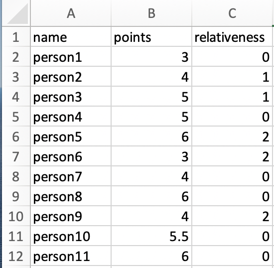

# Covid Testing Random Selector

## Description
>A simple python program that takes an Excel list of of people, a “danger variable” and a variable of relation among the people, that determines the chances of the person to be chosen for testing. 
>
>Two related people won't be chosen in the same test. 
>
>People that have chosen cannot be chosen again for some next tests, then the chanses of getting chosen start to increase linearly, these are all determined by the user. 
>
>The current application can be used to -partly- randomly choosing people to test in a group of many people, such as a company, a hospital, an office etc. 
>
>The user sets the chance of someone to be chosen and their relation with some other individuals. 

## Set-Up

 - The first you have to do to set up the program is to download Python. You can easily download in [the official Python webpage][https://www.python.org/downloads/].
 
 - Download or clone this file and open it. 
 
 - Open Terminal and type "cd" and then drag the folder in,
    
``
cd path/covid_test_list
``

press Enter and then type:

 ``
pip install -r requirements.txt
``

then press enter again. 
Now you have all required libraries to execute the code. 

- Go ahead and open your Excel file. You must have a column with header "names" that will have all the names. 
Also you will name the header of your chances number as "points"
Lastly have a column named "relativeness". People with no relation will get the value 0. Related people will get a number, two related people have the same number. 
Your Excel should look like this:

   >Note that person2 and person3 are reated. Person5,6 and 9 are related. Everyone else doesn't have a relation. 

- Name your Excel file "test_list.xlsx" and save it in the program folder. 

- Check the settings.py file to make the changes you want. 

- Now you are set. Double click main.command and run the program. 
